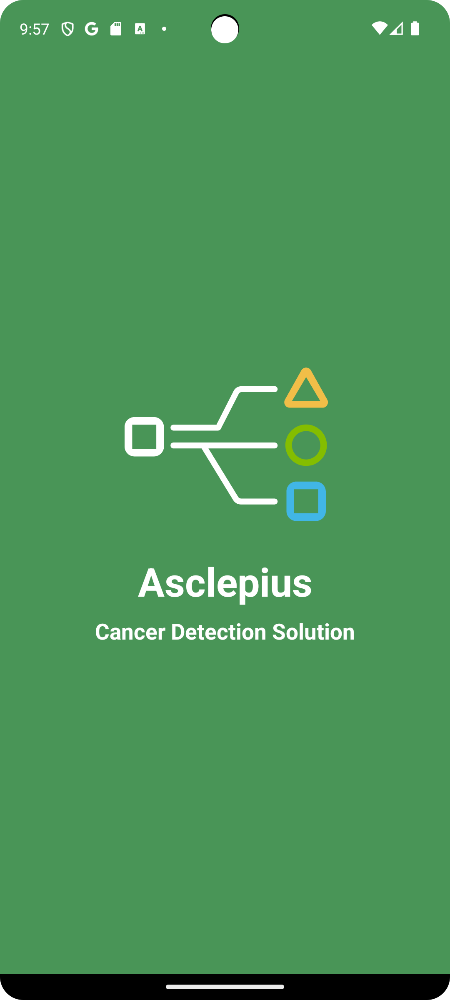
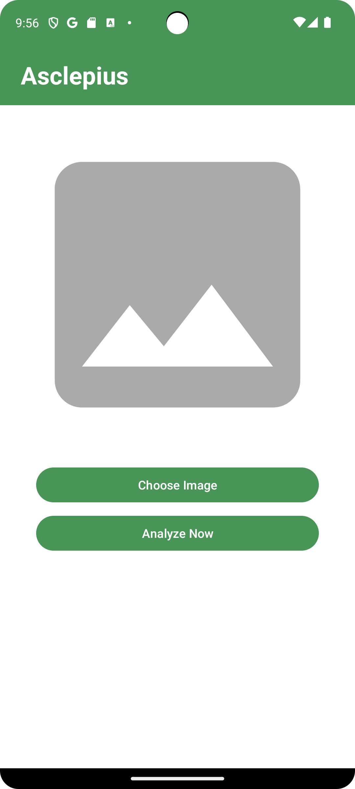
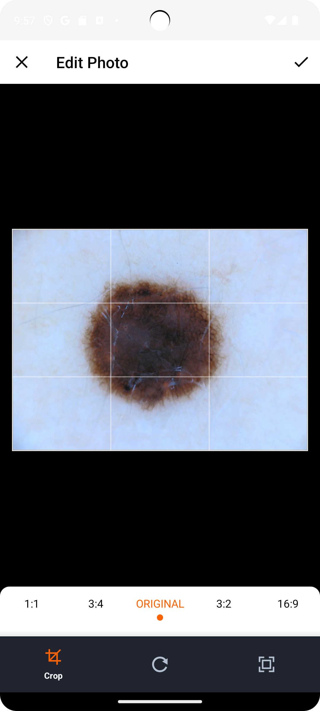
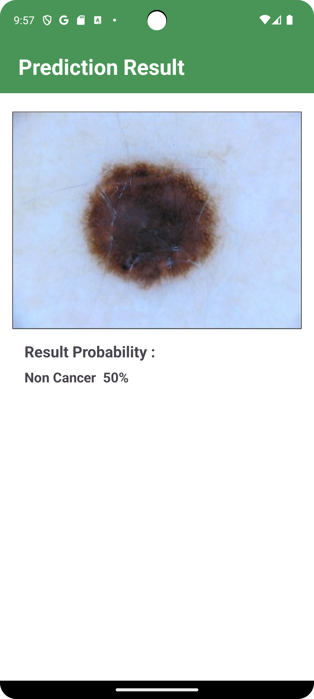

## Asclepius - Cancer Detection Application [Image Based]
Asclepius is Image Based - Cancer Detection Application. Asclepius is built using Kotlin Programming Language and Local Machine Learning Model that will detect cancer by image that provided by users.

## Features
- Machine Learning Support : Detect Cancer from Image that provided by users with Machine Learning help.
- Customize Image Size : Adjust Size of image that want to send to the application with help by <a href="https://github.com/Yalantis/uCrop">uCrop Library</a>.

## Previews
| Splash | Main | uCrop | Prediction Result |
|:----:|:----:| :----:|:----:|
|  |  |  |  |
